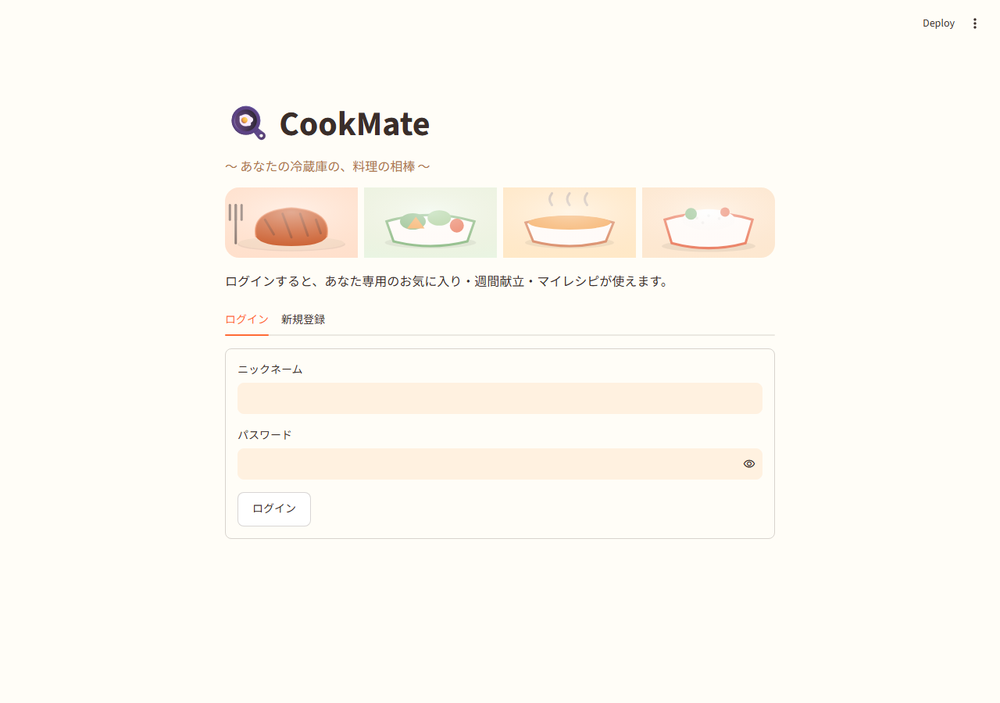
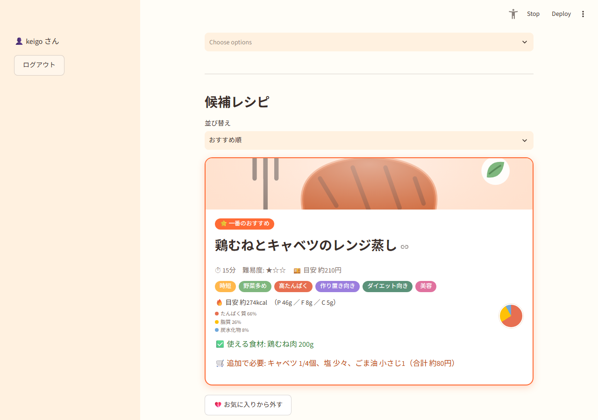
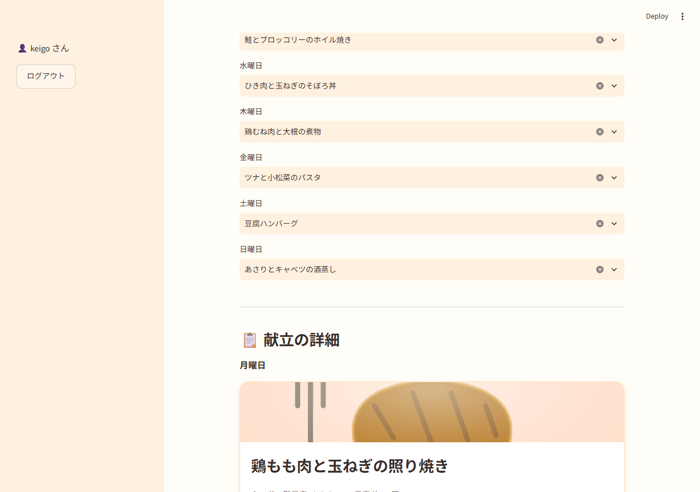
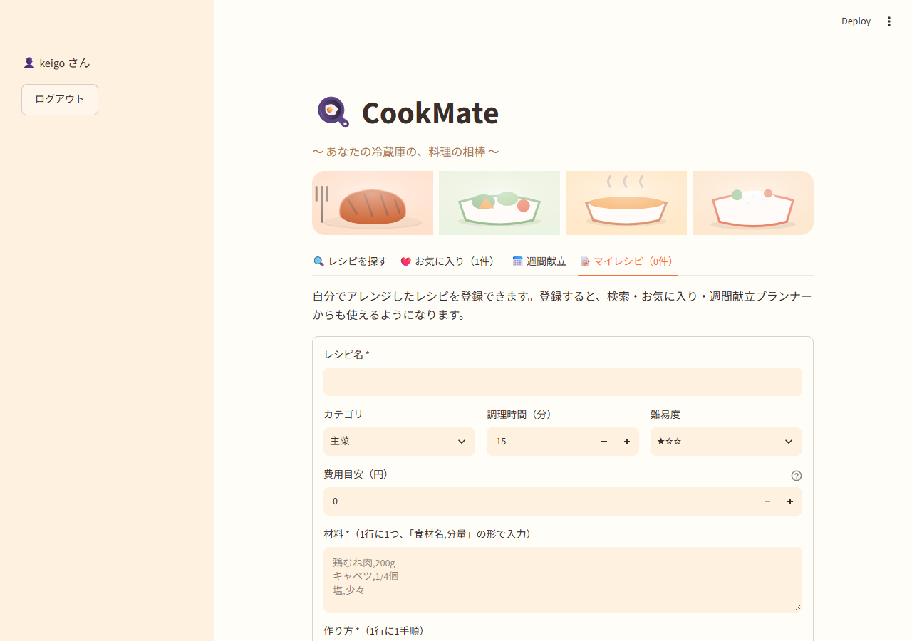

# CookMate

デモ：https://cookmate-app-ovaqyjznmpvchyjjtrdfqc.streamlit.app/

## 目次
### 1.	サービス概要
### 2.	制作背景・目的
### 3.	想定ユーザーと利用場面
### 4.	機能要件
### 5.	画面構成
### 6.	データ要件
### 7.	使用技術・開発環境
### 8.	非機能要件
### 9.	UI・UX上の工夫
### 10.	技術的な工夫と得られた学び
### 11. 今後の改善案

## 1. サービス概要
### 1.1. サービス名
　CookMate：「料理（Cook）」と「相棒（Mate）」を組み合わせた名称である。冷蔵庫にある食材から、AIが一緒に献立を考えてくれる相棒、という位置づけに由来する。

### 1.2. テーマ・概要
　本サービスは、冷蔵庫にある食材から、AIが栄養バランスを考慮したレシピを提案するWebサービスである。  
　利用者は、余っている食材や調理時間などの条件を入力するだけで、条件に合うレシピの提案を受けられる。また、AIに1週間分の献立をまとめて設計してもらうこともでき、栄養バランスの管理が苦手な利用者を支援する。  
　自炊経験が少ない一人暮らしの学生を主な対象とし、食材を無駄にすることなく、日々の食生活の栄養バランスを改善することを目指す。

## 2. 制作背景・目的
### 2.1. 制作背景
　一人暮らしを始めてから、自炊の経験が少ないまま食生活を送る中で、冷蔵庫にある食材から「何を作るか」を決めるのに時間がかかり、同じような料理に偏ったり、栄養バランスが崩れたりする課題に直面した。  
　市販のレシピ検索サービスの多くは、手持ちの食材から1品を提案するにとどまり、栄養バランスを考慮した1週間単位の献立提案まで行うサービスは少ない。AI開発の技術習得も兼ねて、本サービスを制作した。

### 2.2. 目的
　本サービスの目的は、自炊に不慣れな一人暮らしの学生が、冷蔵庫の食材を無駄にせず、栄養バランスの取れた食生活を送れるよう支援することである。  
　食材・条件からレシピを提案するだけでなく、AIによる週単位の献立設計を通じて、栄養管理そのものの手間を軽減することを目指す。

## 3. 想定ユーザーと利用場面
### 3.1. 想定ユーザー
　自炊経験が少なく、栄養バランスの取れた食生活を送ることに課題を感じている一人暮らしの学生を主な利用者として想定する。  
　将来的には、限られた食材で献立を考える必要がある社会人や、家族の食事管理を担う利用者への展開も検討する。

### 3.2.	利用場面
When：買い物前、食事の直前、週末に1週間分の献立を決めるとき等  
Where：自宅、スーパーでの買い物中等  
Who：一人暮らしの学生等  
Why (To What)：手持ちの食材を活用しつつ、栄養バランスの取れた食事を短時間で決めるため  
How：パソコン、スマートフォンなどのWebブラウザを用いる  

### 3.3.	利用の流れ
冷蔵庫の食材を確認  
        ↓  
食材・条件を入力、またはAIに献立設計を依頼  
        ↓  
提案されたレシピ・献立を確認  
        ↓  
不足している食材と費用を確認  
        ↓  
買い物・調理  
        ↓  
気に入ったレシピをお気に入りに登録  

## 4.	機能要件
F-01：レシピ検索（食材・調理時間・カテゴリ・タグからレシピを検索する）  
F-02：意味検索（自由記述の文章から、意味の近いレシピをAIが検索する）  
F-03：栄養バランス表示（カロリー・PFCバランスを数値化して表示する）  
F-04：週間献立の自動設計（AIが1週間分の献立を栄養バランスを考慮して提案する）  
F-05：目標に応じた献立カスタマイズ（高たんぱく・カロリー控えめなど要望に応じて献立を調整する）  
F-06：買い物リスト自動生成（週間献立から必要な食材と費用をまとめる）  
F-07：お気に入り登録（気に入ったレシピを保存する）  
F-08：マイレシピ登録（自分でアレンジしたレシピを登録する）  
F-09：ログイン機能（ニックネームとパスワードで利用者を識別し、データを分離する）  

### 4.1.	検索時の入力項目
| 項目 | 入力形式 | 必須/任意 | 内容 |
|:---:|:---:|:---:|:---:|
| 使いたい食材 | 複数選択 | 任意 | 冷蔵庫にある食材をカテゴリ別に選択する |
| その他の食材 | 1行入力 | 任意 | 選択肢に無い食材を自由入力する |
| こんな料理が食べたい | 複数行入力 | 任意 | 食べたい料理の自由記述（意味検索） |
| 調理時間の上限 | スライダー | 任意 | 希望する調理時間の上限（分） |
| カテゴリ | 選択 | 任意 | 主菜・副菜などの分類 |
| こだわりたい条件 | 複数選択 | 任意 | 時短・野菜多めなどのタグ |

## 5.	画面構成
### 5.1.	画面一覧
S-01：ログイン・新規登録画面（ニックネームとパスワードで利用者を識別する）  
S-02：レシピ検索画面（食材・条件を入力し、候補レシピを表示する）  
S-03：お気に入り画面（登録済みのお気に入りレシピを一覧表示する）  
S-04：週間献立画面（曜日ごとにレシピを割り当て、買い物リストを表示する）  
S-05：マイレシピ画面（自分で登録したレシピを一覧表示・登録・削除する）  

### 5.2.	画面遷移
【ログイン・新規登録画面】  
       ↓ ログイン  
【レシピ検索画面】────────→【お気に入り画面】  
       │  
       ├──→【週間献立画面】  
       │  
       └──→【マイレシピ画面】  

### 5.3.	画面イメージ
図１　ログイン画面  
  

図２　レシピ検索画面  
  

図３　週間献立画面  
  

図４　マイレシピ画面  
  

## 6.	データ要件
### 6.1. テーブル一覧
users：ログイン用のニックネームとパスワードハッシュを保存するテーブル  
favorites：利用者ごとのお気に入りレシピを保存するテーブル  
meal_plans：利用者ごとの週間献立を保存するテーブル  
custom_recipes：利用者が登録したマイレシピを保存するテーブル  

### 6.2. 各テーブルの詳細
＜users＞
| カラム名 | データ型 | 説明 |
|---|---|---|
| id | uuid | 利用者を一意に識別する番号 |
| username | text | ログインに使うニックネーム |
| password_hash | text | bcryptでハッシュ化したパスワード |
| created_at | timestamptz | 登録日時 |  

＜favorites＞
| カラム名 | データ型 | 説明 |
|---|---|---|
| id | uuid | お気に入りを一意に識別する番号 |
| user_id | uuid | お気に入りを登録した利用者のID |
| recipe_id | text | お気に入りに登録したレシピのID |
| created_at | timestamptz | 登録日時 |  

＜meal_plans＞
| カラム名 | データ型 | 説明 |
|---|---|---|
| id | uuid | 献立を一意に識別する番号 |
| user_id | uuid | 献立を登録した利用者のID |
| day | text | 曜日（月〜日） |
| recipe_id | text | 割り当てたレシピのID |
| updated_at | timestamptz | 更新日時 |  

＜custom_recipes＞
| カラム名 | データ型 | 説明 |
|---|---|---|
| id | text | マイレシピを一意に識別する番号 |
| user_id | uuid | 登録した利用者のID |
| title | text | レシピ名 |
| category | text | カテゴリ |
| time_minutes | int | 調理時間（分） |
| difficulty | int | 難易度 |
| price_yen | int | 費用目安（円） |
| ingredients | jsonb | 材料（食材名・分量のリスト） |
| steps | jsonb | 作り方の手順 |
| tags | jsonb | タグ |
| storage | text | 保存方法 |
| arrange_tip | text | アレンジ方法 |
| nutrition_note | text | 栄養の特徴 |
| created_at | timestamptz | 登録日時 |  

### 6.3. テーブル間の関係
　favorites・meal_plans・custom_recipesは、いずれもuser_idを保持し、usersテーブルと関連付けられる。これにより、利用者ごとにデータが分離され、複数人が同時に利用してもお気に入りや献立が混ざらない構成とする。  

## 7.	使用技術・開発環境
### 7.1. 使用技術
<table>
  <thead>
    <tr>
      <th>区分</th>
      <th>使用技術</th>
      <th>用途</th>
    </tr>
  </thead>
  <tbody>
    <tr>
      <td>フレームワーク</td>
      <td>Python, Streamlit</td>
      <td>画面表示・アプリ全体の処理</td>
    </tr>
    <tr>
      <td>LLM</td>
      <td>Anthropic Claude API (claude-haiku-4-5)</td>
      <td>レシピ提案文の生成、週間献立の設計</td>
    </tr>
    <tr>
      <td rowspan="2">意味検索</td>
      <td>sentence-transformers (multilingual-e5-small)</td>
      <td>文章を埋め込みベクトルに変換</td>
    </tr>
    <tr>
      <td>Chroma</td>
      <td>ベクトルデータベースでの類似レシピ検索</td>
    </tr>
    <tr>
      <td>データベース</td>
      <td>Supabase (PostgreSQL)</td>
      <td>利用者情報・お気に入り・献立の保存</td>
    </tr>
    <tr>
      <td>認証</td>
      <td>bcrypt</td>
      <td>パスワードのハッシュ化</td>
    </tr>
    <tr>
      <td>ホスティング</td>
      <td>Streamlit Community Cloud</td>
      <td>Webアプリの公開</td>
    </tr>
  </tbody>
</table>  

### 7.2. 開発環境
OS：Windows 11  
コードエディタ：Claude Code  
バージョン管理：GitHub  
動作確認ブラウザ：Google Chrome  
データベース管理：Supabase管理画面  

## 8.	非機能要件
NF-01：操作性（食材の選択や条件の入力だけで、専門知識が無くてもレシピを検索できる）  
NF-02：視認性（おすすめのレシピを枠線とバッジで強調し、一目で分かるようにする）  
NF-03：応答性（条件を変更すると、再検索ボタンを押さずに候補レシピが即座に切り替わる）  
NF-04：対応端末（パソコンとスマートフォンのブラウザで、崩れずに操作できる）  
NF-05：可用性（ベクトルデータベースが空の状態でも、検索時に自動で作り直され、機能が止まらない）  
NF-06：秘匿性（パスワードはハッシュ化して保存し、APIキーなどの機密情報はGitHubに含めない）  
NF-07：保守性（検索・AI連携・データ保存・画面表示の処理をファイルごとに分離した構成）  

## 9.	UI/UX上の工夫
### 9.1.	条件を変えるたびに即座に切り替わる検索結果
　検索条件の入力欄を送信ボタン付きのフォームにせず、条件を選ぶたびに即座に再検索する設計にした。一方で、AIによるコメント生成はAPIの呼び出し費用がかかるため、ボタンを押したときだけ生成する方式とし、操作性とコストのバランスを取った。  

### 9.2.	栄養バランスの視覚化
　カロリーとPFC（たんぱく質・脂質・炭水化物）バランスを、数値だけでなく円グラフでも表示し、栄養の専門知識が無くても一目でバランスを把握できるようにした。  

### 9.3.	迷わない献立管理
　週間献立の選択欄には、選択済みのレシピをワンタッチで解除できる標準の✕ボタンのみを配置し、紛らわしい選択肢を表示しないようにした。また、AIが決めた献立の理由も、画面上にコメントとして表示する。  

## 10.	技術的な工夫と得られた学び
### 10.1.	RAGによるハルシネーション対策
　LLM（大規模言語モデル）単体にレシピを考えさせると、実際には存在しないレシピを作り出してしまう可能性がある（ハルシネーション）。この問題に対応するため、自作したレシピデータ（100件）をあらかじめ用意し、検索でヒットした実在のレシピのみをLLMに渡し、その範囲内でのみ回答させるRAG（Retrieval-Augmented Generation）の構成を採用した。プロンプトにも「渡された候補の中からのみ話す」ことを明示し、存在しないレシピを紹介しないよう制御している。  

### 10.2.	埋め込みベクトル検索の導入
　当初は、食材名やタグの一致度だけでレシピを探す構造化検索のみを実装していた。しかし使ってみると、「さっぱりした野菜多めの一品」のように、食材名を指定しない曖昧な要望には対応できないという課題を感じた。  
　そこで、文章を埋め込みベクトル（文章の意味を数値の並びに変換した情報）に変換し、意味的に近いレシピを検索する仕組みを導入した。埋め込みモデルにはsentence-transformers（multilingual-e5-small）を採用し、ベクトルの保存・類似度計算は専用のベクトルデータベースであるChromaに任せる構成とした。食材の一致スコアと意味的な近さのスコアを合算するハイブリッド検索とすることで、具体的な食材からの検索と、曖昧な言葉での検索の両方に対応できるようにした。  

### 10.3.	Tool Use（Function Calling）による構造化出力
　週間献立の自動設計機能では、AIに自由な文章で回答させるのではなく、Tool Use（Function Calling）という仕組みを用いて「assign_weekly_plan」という決まった形式（曜日→レシピID）で回答させている。これにより、AIの出力をそのままアプリのデータとして安全に扱える。さらに、返ってきた内容（全曜日そろっているか、実在するレシピIDか、重複がないか）を必ず検証し、不正な形式のときは反映しない仕組みを入れた。  

### 10.4.	開発中に見つけて対応した問題
　AIの構造化データとテキスト説明の不整合：週間献立の理由説明文で、AIが実際には選んでいないレシピ名を挙げてしまう不具合を発見した。構造化データ（Tool Use）が正しくても、自由記述の説明文は別途検証が必要という学びを得て、プロンプトに自己チェックの指示を追加して解消した。  
　Streamlitのウィジェット状態管理の癖：AIが決めた献立が画面に反映されない不具合を調査し、選択欄（selectbox）がウィジェット自身の状態を保持し続ける仕様が原因と特定した。プログラムからの更新とウィジェットの状態を両方書き換える形で解決した。  
　SSL証明書エラー：埋め込みモデルのダウンロード時、およびSupabaseへの接続時に、それぞれ証明書検証エラーが発生した。最初はpip-system-certsというライブラリで対応したが、Anthropic APIとの通信で無限再帰エラーを引き起こす副作用があったため不採用とし、通信先ごとに適した解決方法（モデルは一度ダウンロードすれば再確認しない設定、Supabaseへの接続はOSの証明書をそのまま使うtruststoreというライブラリ）を選定した。  
　デプロイ環境特有の制約：Streamlit Community Cloudはファイルシステムが一時的で、保存していたベクトルデータベースが再起動時に消えてしまう。検索実行時にデータベースが空であれば自動的に作り直す仕組みを入れ、手動セットアップなしで動くようにした。  
　レスポンシブ対応の不具合：スマートフォン幅で開くと、横並びレイアウトの中の画像が画面外にはみ出す不具合を発見した。Flexboxでよく知られた挙動（比率の決まった画像が要素の最小幅を広げてしまう）が原因と特定し、該当要素の最小幅を0に指定して解決した。  

## 11.	今後の改善案
### 11.1.	スマートフォンアプリとしての提供
　現在はWebブラウザからの利用を前提としているが、将来的にはホーム画面から起動できるアプリとしての提供を検討する。  

### 11.2.	栄養バランスの評価精度向上
　現在の栄養価は、食材ごとの目安値を合計する簡易的な計算方法である。将来的には、より精度の高い栄養計算方法の導入を検討する。  

### 11.3.	レシピデータの拡充
　現在は自作した100件のレシピデータを使用している。将来的には、レシピ数の拡充や、外部レシピデータとの連携を検討する。  

### 11.4.	献立の栄養バランスの日次管理
　現在は「1週間を通して品目が偏らないこと」を基準に献立を設計しているが、将来的には1日単位のカロリー・栄養管理にも対応することを検討する。  

## 注意事項
APIキーやデータベースの接続情報は、セキュリティ保護のためGitHubには含めていない。
